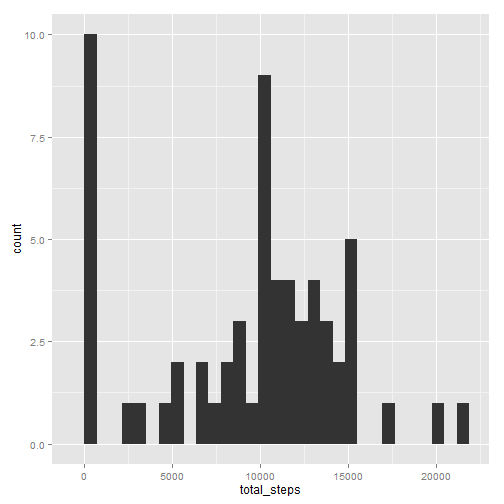
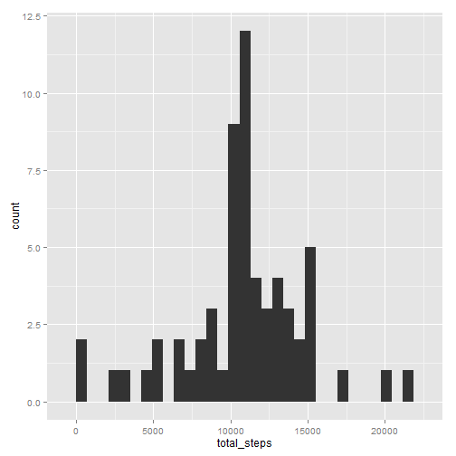
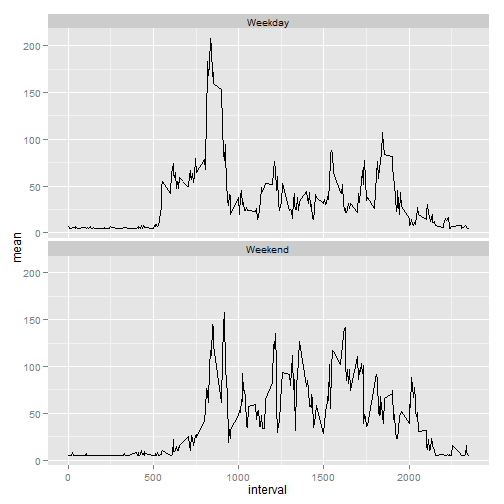

## Load Libraries

```r
library(ggplot2)
library(plyr)
```

# Loading and preprocessing the data

### Load Data and set date as date variable


```r
activity=read.csv("activity.csv", as.is=T, stringsAsFactors=F, na.strings="NA")
activity$date=as.Date(activity$date)
```

# What is mean total number of steps taken per day?


### Calculate the mean by Date. Ignore NA and show count.


```r
activity2=activity
#activity2 = activity[!is.na(activity$steps), ]
meanByDate=ddply(activity2, .(date), summarize, total_steps=sum(steps, na.rm=T), median=median(steps, na.rm=T), mean=mean(steps, na.rm=T))
```

### Plot mean and Median by Date


### 1. Make a histogram of the total number of steps taken each day


```r
ggplot(meanByDate, aes(x=total_steps)) + geom_histogram(stat="bin" )
```

```
## stat_bin: binwidth defaulted to range/30. Use 'binwidth = x' to adjust this.
```

 

### 2. Calculate and report the mean and median total number of steps taken per day

<table sytle="width:100%;border: 1px solid black;border-collapse: collapse;">
<tr ><td style="padding: 5px;border: 1px solid black;border-collapse: collapse;" >Mean of Total Steps</td><td style="padding: 5px;border: 1px solid black;border-collapse: collapse;">9354.2295082</td></tr>
<tr><td style="padding: 5px;border: 1px solid black;border-collapse: collapse;">Median of Total Steps</td><td style="padding: 5px;border: 1px solid black;border-collapse: collapse;">10395</td></tr>
</table>

# What is the average daily activity pattern?

### Calculate daily mean for each interval


```r
meanByStep=ddply(activity2, .(interval), summarize, total_steps=sum(steps, na.rm=T), median=median(steps, na.rm=T), mean=mean(steps, na.rm=T))
maxval = meanByStep[meanByStep$total_step==max(meanByStep$total_steps), ]
```

### 1. Make a time series plot (i.e. type = "l") of the 5-minute interval (x-axis) and the average number of steps taken, averaged across all days (y-axis)


```r
ggplot(meanByStep, aes(x=interval, y=mean)) + geom_line()
```

 

### 2. Which 5-minute interval, on average across all the days in the dataset, contains the maximum number of steps?

#### Interval 835 contain the max number of steps.


# Imputing missing values

### 1. Calculate and report the total number of missing values in the dataset (i.e. the total number of rows with NAs)

#### There are 2304 of intervals with missing values.

### 2. Devise a strategy for filling in all of the missing values in the dataset. The strategy does not need to be sophisticated. For example, you could use the mean/median for that day, or the mean for that 5-minute interval, etc.


### 3. Create a new dataset that is equal to the original dataset but with the missing data filled in.
### 4. Make a histogram of the total number of steps taken each day and Calculate and report the mean and median total number of steps taken per day. Do these values differ from the estimates from the first part of the assignment? What is the impact of imputing missing data on the estimates of the total daily number of steps?


```r
activityImputed = activity
activityImputed[is.na(activityImputed$steps), "steps"] = mean(activityImputed$steps,na.rm=T)
meanByDateImputed=ddply(activityImputed, .(date), summarize, total_steps=sum(steps, na.rm=T), median=median(steps, na.rm=T), mean=mean(steps, na.rm=T))
meanTotalStepsImputed=mean(meanByDateImputed$total_steps)
medianTotalStepsImputed=median(meanByDateImputed$total_steps)
ggplot(meanByDateImputed, aes(x=total_steps)) + geom_histogram(stat="bin" )
```

```
## stat_bin: binwidth defaulted to range/30. Use 'binwidth = x' to adjust this.
```

 

The new mean is: 1.0766189 &times; 10<sup>4</sup> and
the meadian is : 1.0766189 &times; 10<sup>4</sup> .

After imputing the values both mean and median are different.

# Are there differences in activity patterns between weekdays and weekends?
Yes.


```r
activityImputed$date=as.Date(activityImputed$date)
activityImputed$week= ifelse(weekdays(activityImputed$date) == "Saturday" | weekdays(activityImputed$date) == "Sunday", "Weekend", "Weekday")

meanByStepImputedByWeek=ddply(activityImputed, .(interval, week), summarize, total_steps=sum(steps, na.rm=T), median=median(steps, na.rm=T), mean=mean(steps, na.rm=T))
ggplot(meanByStepImputedByWeek, aes(x=interval, y=mean)) + facet_wrap( ~ week, ncol=1) + geom_line()
```

 


